# Advanced Mermaid Examples

This page demonstrates more advanced Mermaid diagrams with advanced features and
real-world use cases.

## Advanced Flowchart with Subgraphs

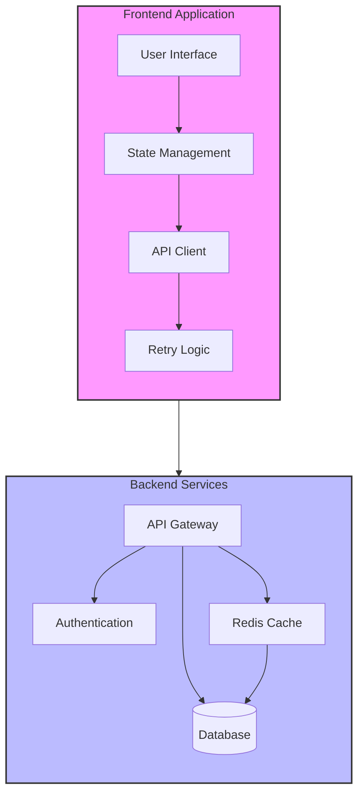

## Advanced Sequence Diagram with Activation and Notes

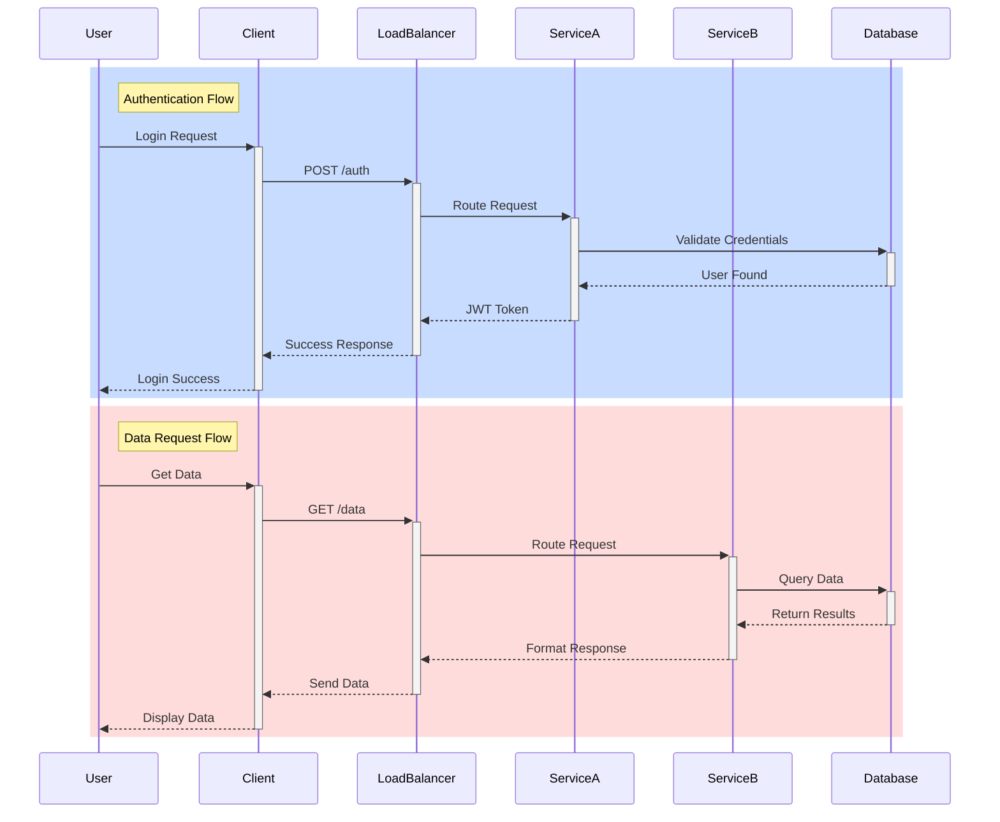

## Advanced Git Graph

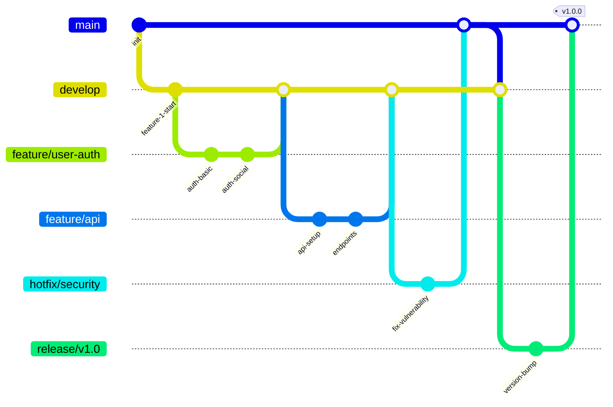

## Advanced State Machine

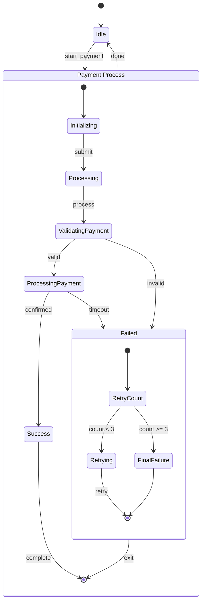

## Advanced ER Diagram with Relationships

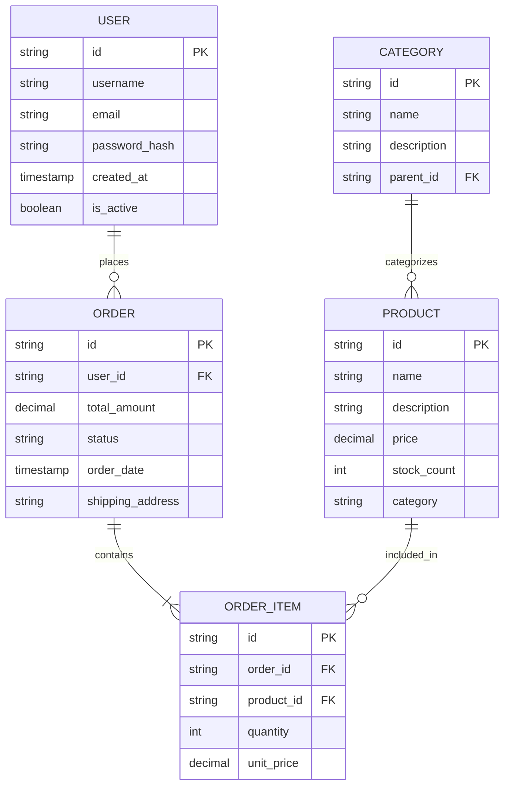

## Advanced C4 Diagram

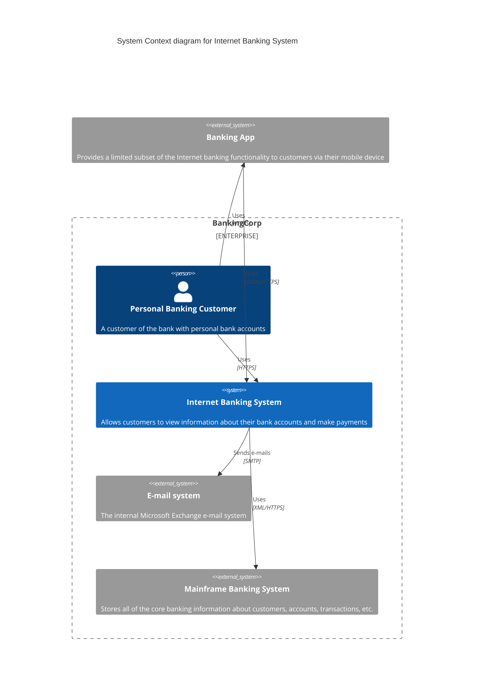

## Swimlane Diagram

```mermaid
swimlane-beta LR
    subgraph Customer
        request[Open request]
        update[Receive update]
    end

    subgraph Support
        triage[Triage request]
        answer[Send answer]
    end

    request --> triage --> answer --> update
```

## Class Diagram

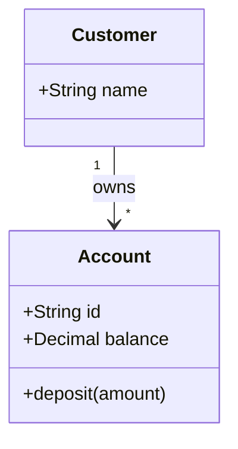

## User Journey

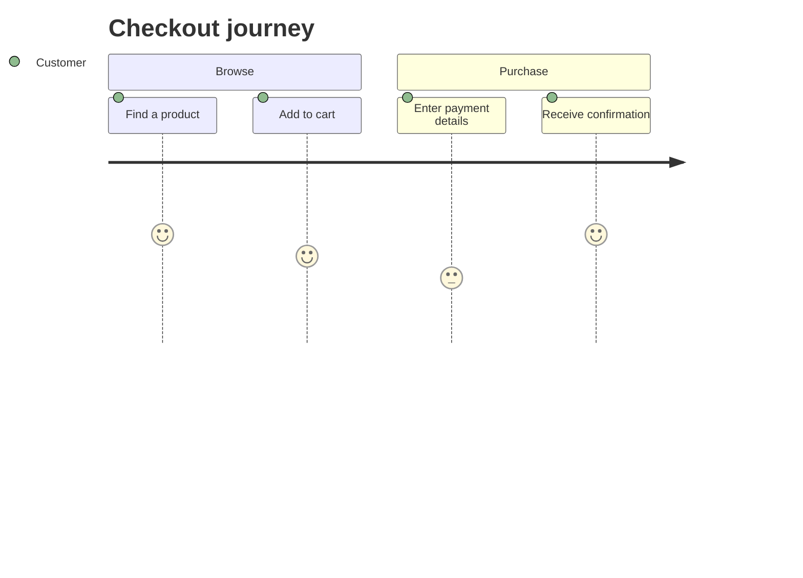

## Gantt Chart

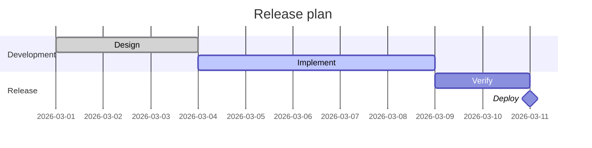

## Pie Chart

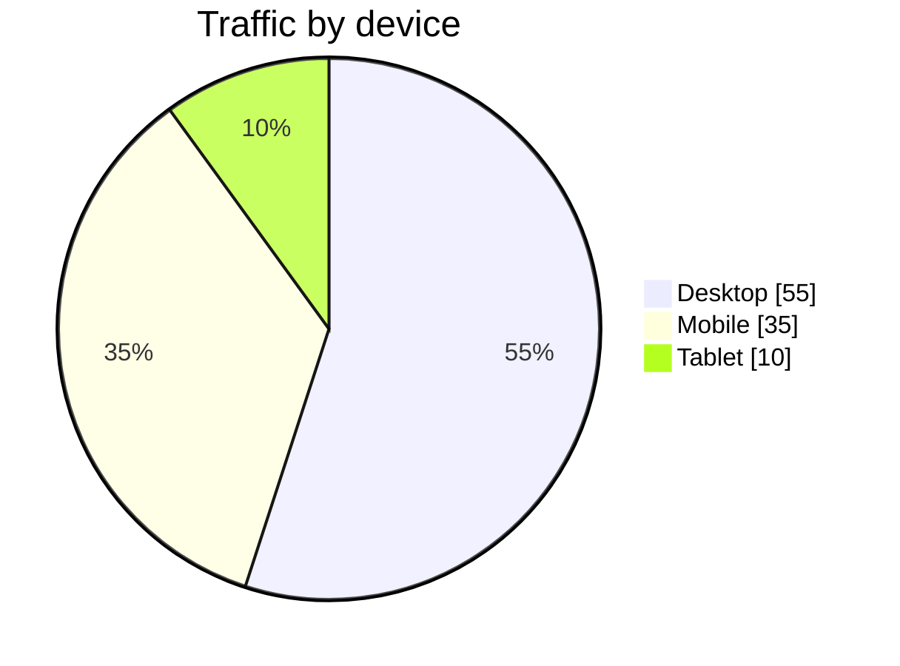

## Quadrant Chart

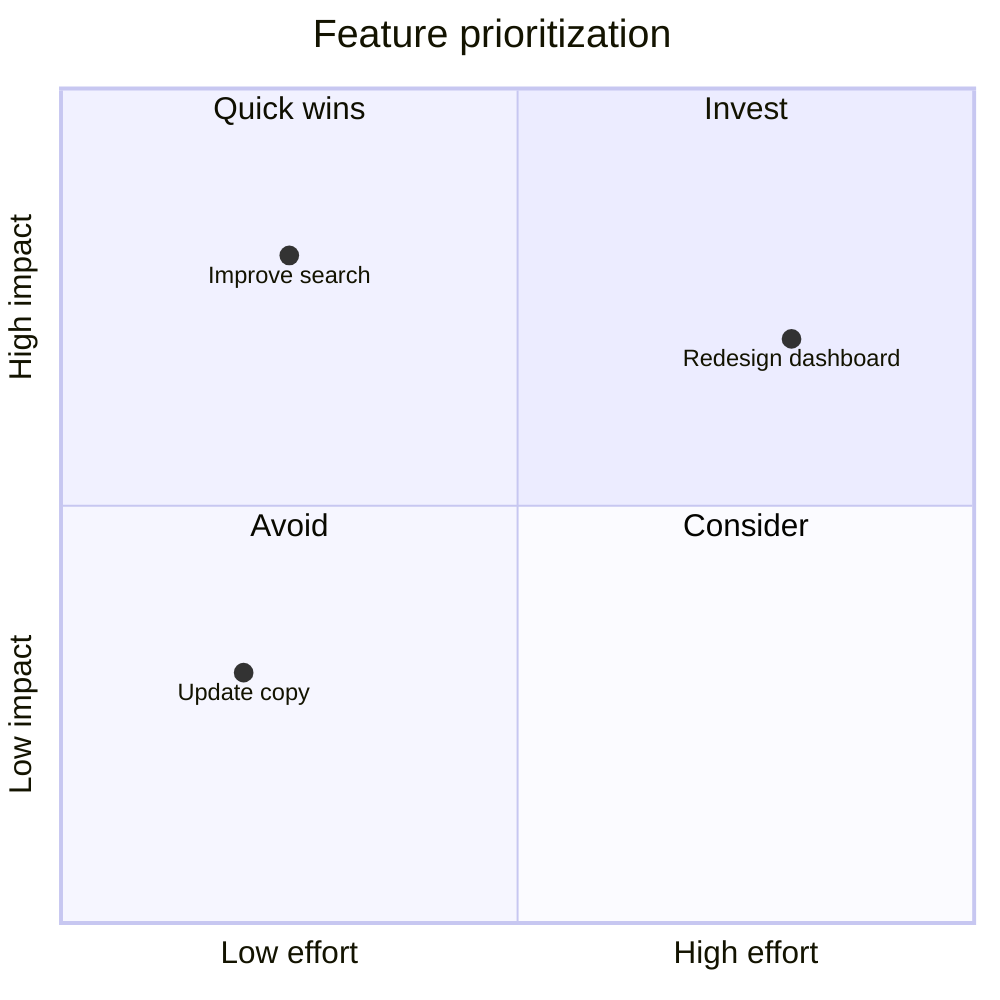

## Requirement Diagram

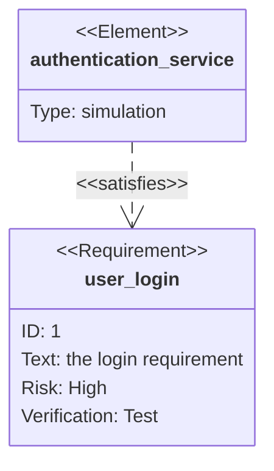

## Mindmap

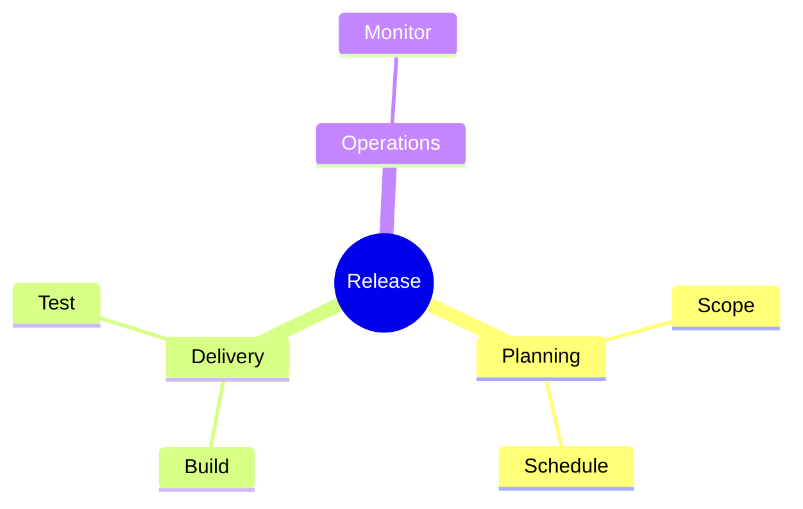

## Timeline

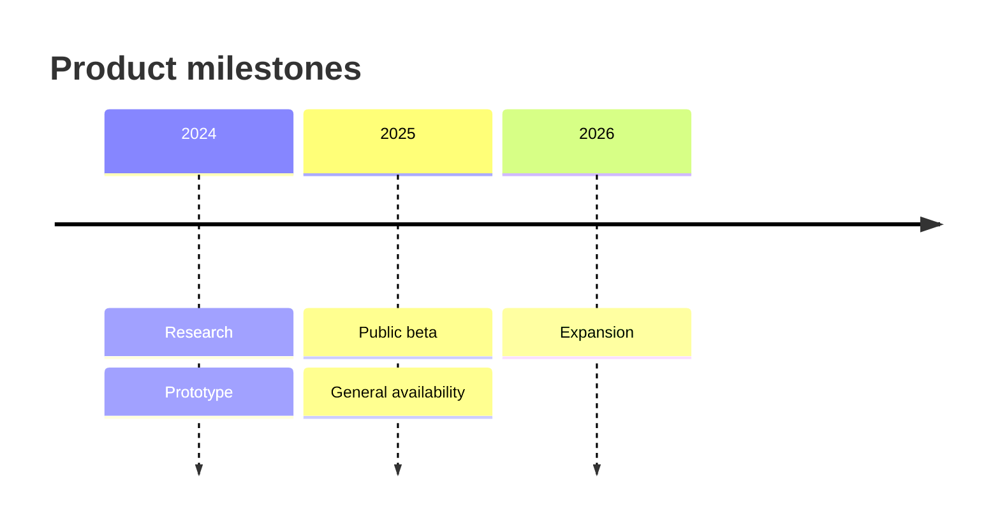

## ZenUML Sequence Diagram

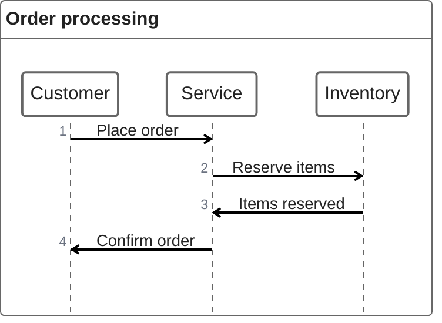

## Sankey Diagram

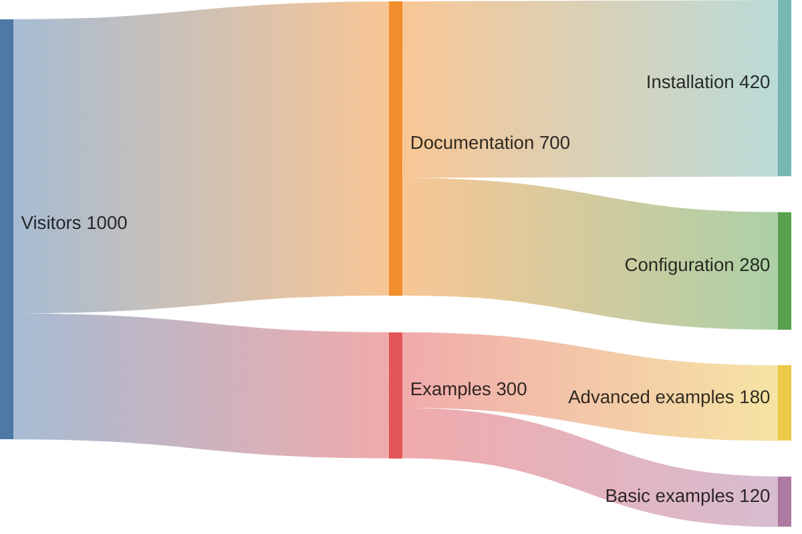

## XY Chart

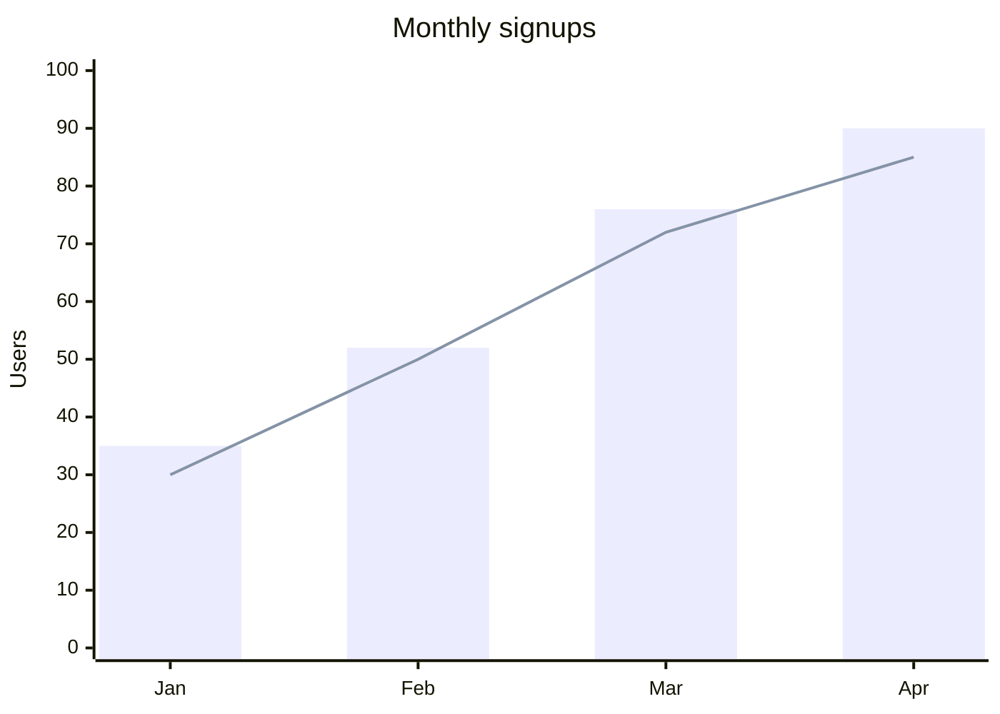

## Block Diagram

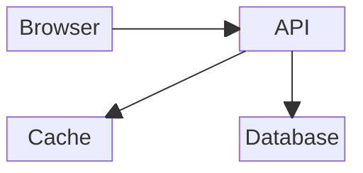

## Packet Diagram

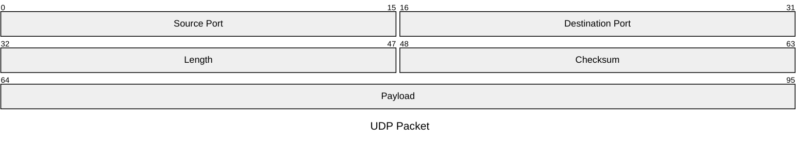

## Kanban Board

```mermaid
kanban
    backlog[Backlog]
        research[Research requirements]
    progress[In progress]
        implement[Implement renderer]@{ assigned: "Developer", priority: "High" }
    done[Done]
        tests[Add browser tests]
```

## Architecture Diagram

```mermaid
architecture-beta
    group platform(cloud)[Platform]

    service web(server)[Web app] in platform
    service api(server)[API] in platform
    service data(database)[Database] in platform

    web:R --> L:api
    api:B --> T:data
```

## Radar Chart

```mermaid
radar-beta
    title Engineering metrics
    axis quality["Quality"], delivery["Delivery"], reliability["Reliability"]
    curve current["Current"]{80, 70, 75}
    curve target["Target"]{90, 85, 90}
    max 100
```

## Event Modeling Diagram

```mermaid
eventmodeling

    tf 01 ui CheckoutUI
    tf 02 cmd SubmitOrder
    tf 03 evt OrderSubmitted
```

## Treemap

```mermaid
treemap-beta
    "Documentation"
        "Guides": 45
        "Examples": 30
    "Source"
        "Components": 35
        "Composables": 20
```

## Venn Diagram

```mermaid
venn-beta
    title "Team skills"
    set frontend[Frontend]
    set backend[Backend]
    union frontend,backend[Full stack]
```

## Ishikawa Diagram

```mermaid
ishikawa-beta
    Slow page load
    Network
        High latency
        Large payloads
    Application
        Expensive queries
        Uncached responses
    Browser
        Blocking scripts
```

## Wardley Map

```mermaid
wardley-beta
    title Delivery platform

    anchor User [0.9, 0.9]
    component WebApp [0.75, 0.6]
    component API [0.6, 0.7]
    component Cloud [0.3, 0.9]

    User -> WebApp
    WebApp -> API
    API -> Cloud
```

## Cynefin Framework

```mermaid
cynefin-beta
    title Delivery decisions

    complex
        "Explore a new product"
    complicated
        "Tune a database"
    clear
        "Apply a routine update"
    chaotic
        "Restore an unavailable service"
    confusion
        "Classify an incident"

    complex --> complicated : "Pattern identified"
    clear --> chaotic : "Complacency"
```

## TreeView Diagram

```mermaid
treeView-beta
    vitepress-mermaid-renderer/
        src/
            MermaidDiagram.vue
            index.ts
        tests/
            e2e/
        package.json
```
