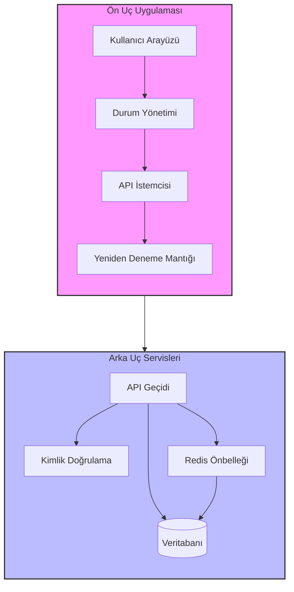
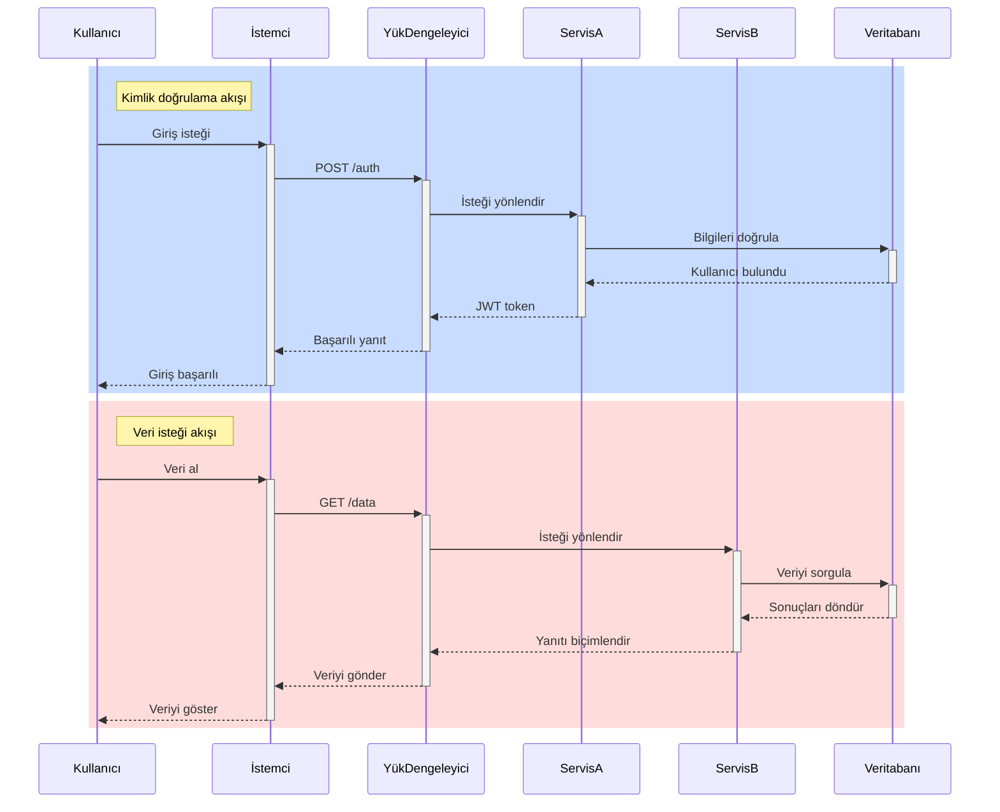
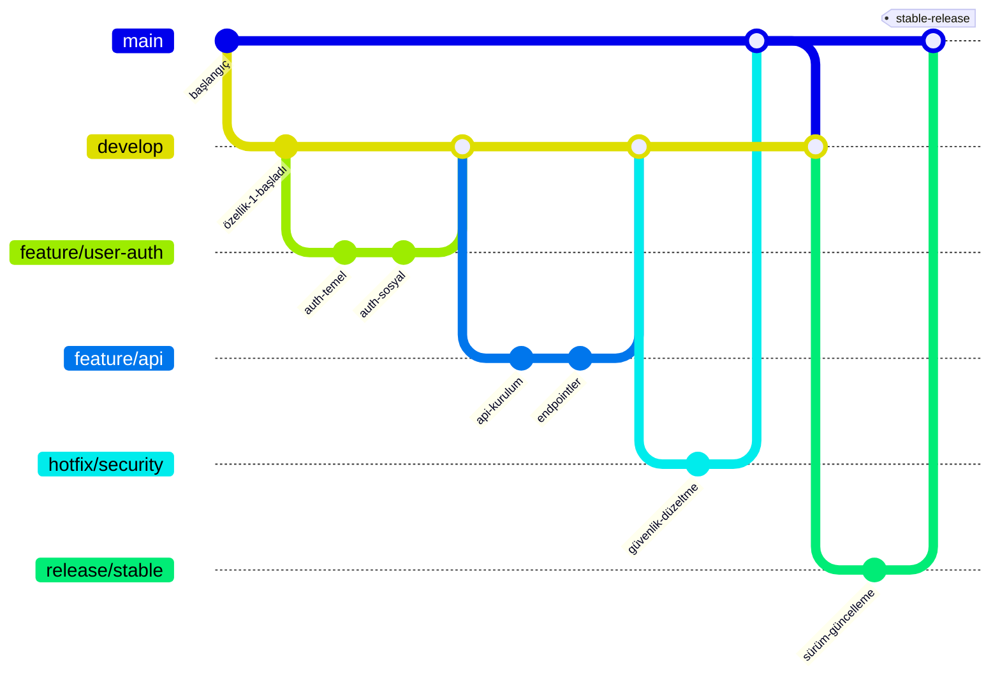
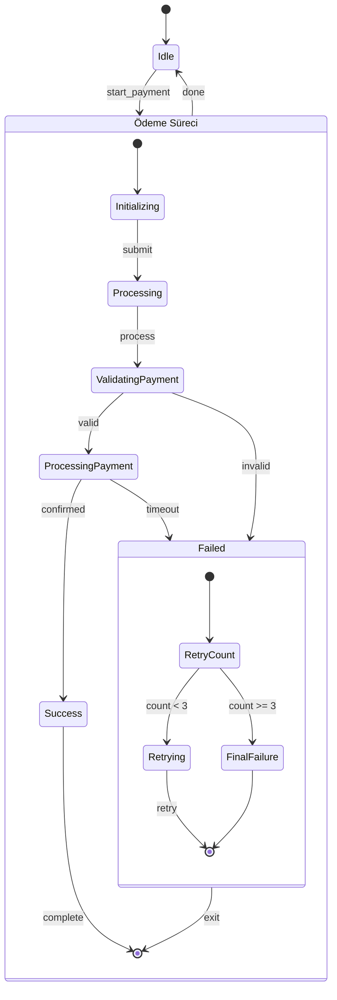
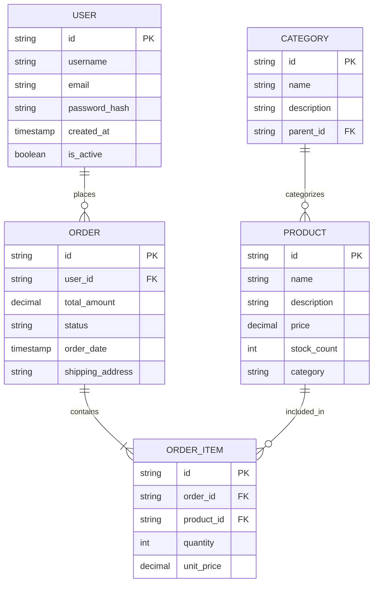
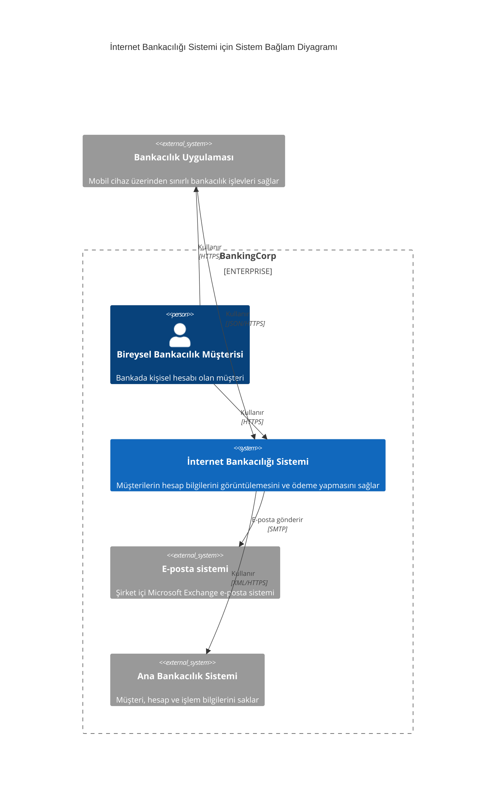

# Gelişmiş Mermaid Örnekleri

Bu sayfa daha büyük ve gerçek dünyaya yakın Mermaid diyagramları üzerinde araç
çubuğu davranışını gösterir. Geniş diyagramlarda tam ekran, reset ve indirme
kontrolleri özellikle faydalıdır.

## Alt Grafikler İçeren Akış Diyagramı

## Aktivasyon ve Notlar İçeren Sıralama Diyagramı

## Gelişmiş Git Grafiği

## Gelişmiş Durum Makinesi

## Gelişmiş ER Diyagramı

## C4 Diyagramı

