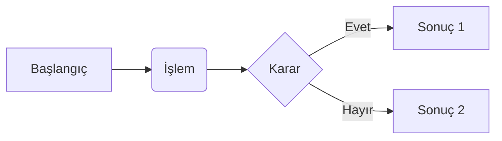
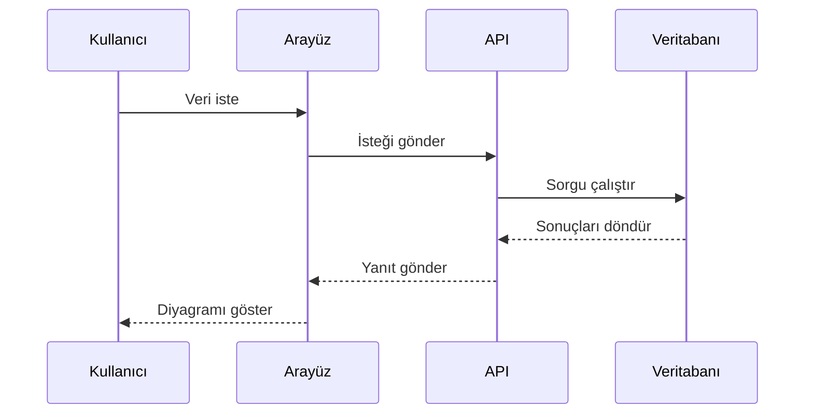
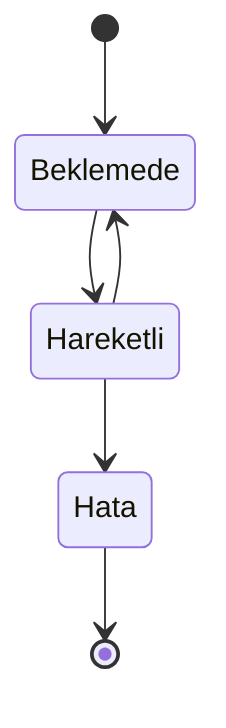
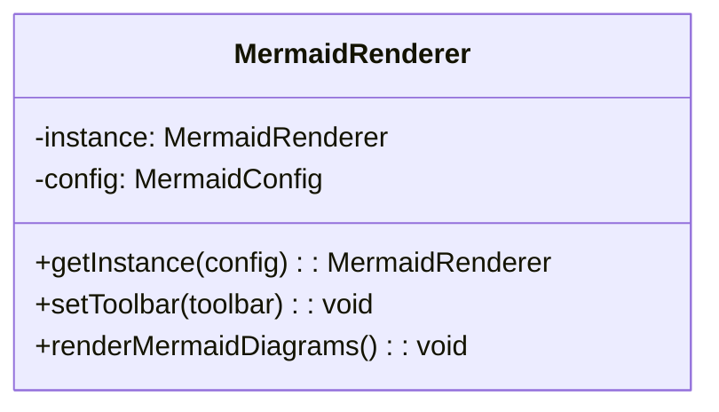
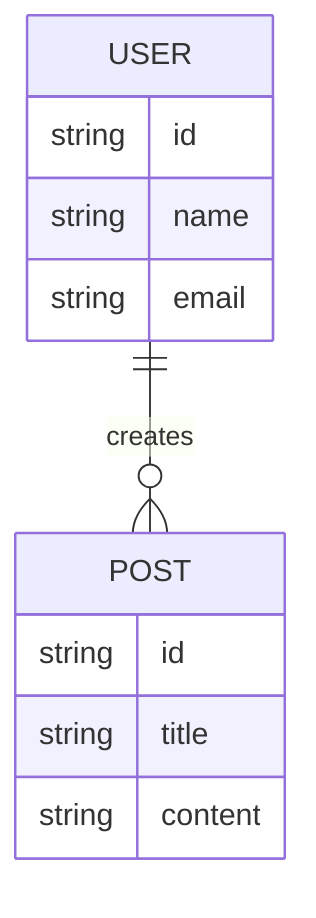
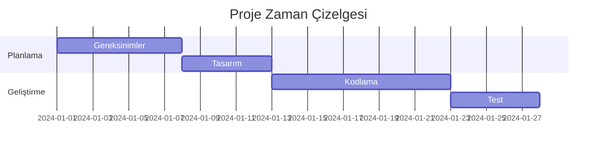
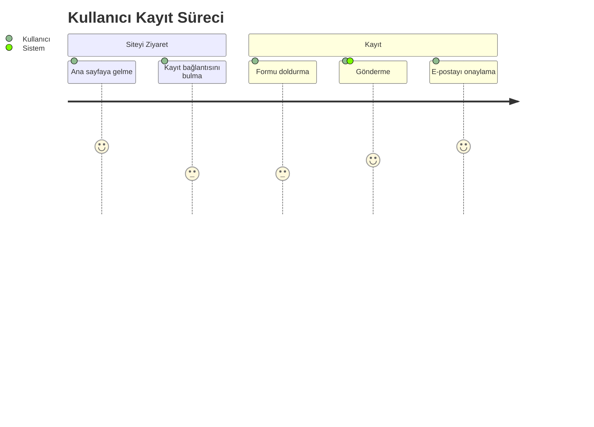

# Temel Örnekler

Bu sayfa, Mermaid diyagram tiplerinin Türkçe dokümantasyon içinde etkileşimli
kontrollerle nasıl render edildiğini gösterir. Her diyagram yakınlaştırılabilir,
sürüklenebilir, sıfırlanabilir, tam ekrana alınabilir, indirilebilir ve kaynak
kodu kopyalanabilir.

## Akış Diyagramı

## Sıralama Diyagramı

## Durum Diyagramı

## Sınıf Diyagramı

## Varlık İlişki Diyagramı

## Gantt Grafiği

## Yolculuk Diyagramı

