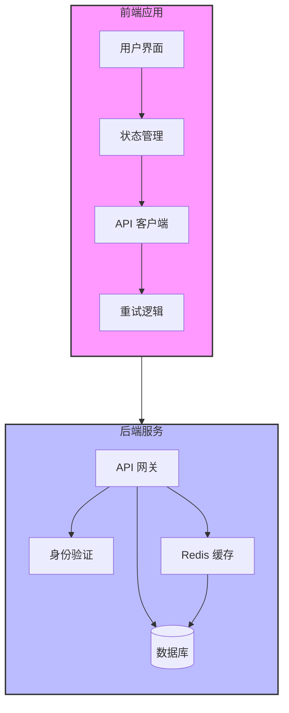
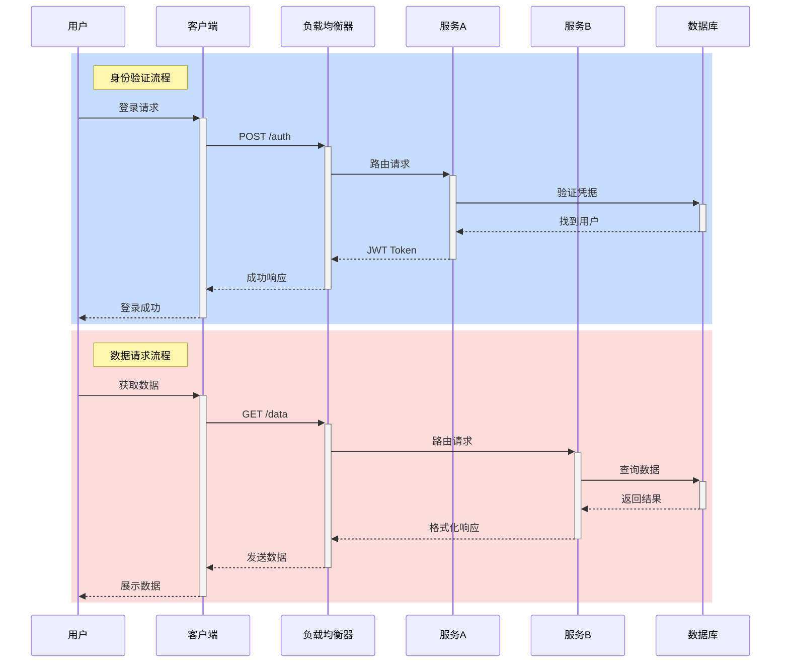
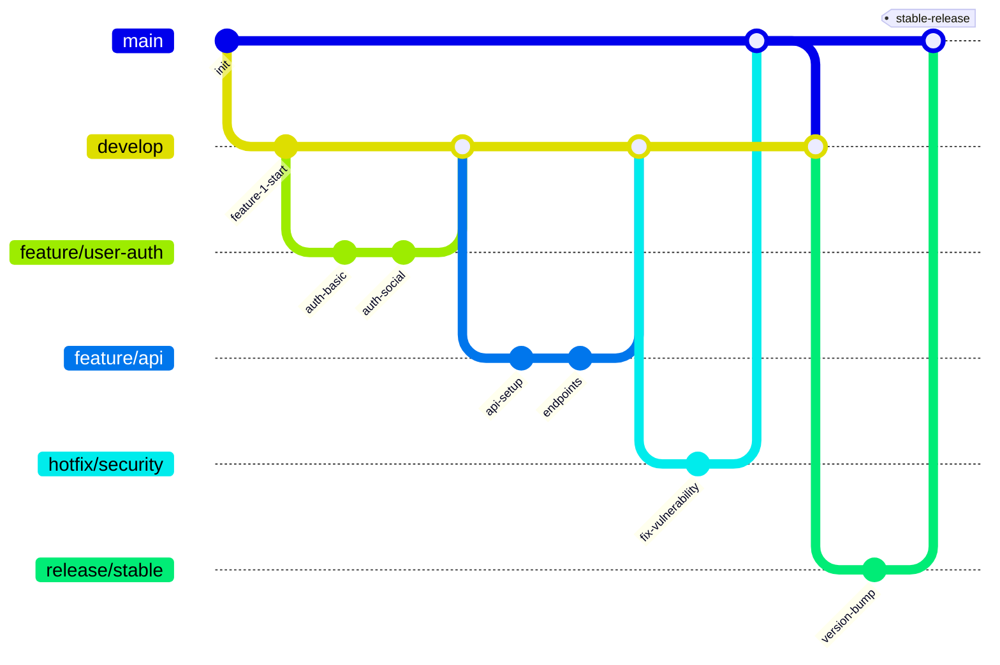
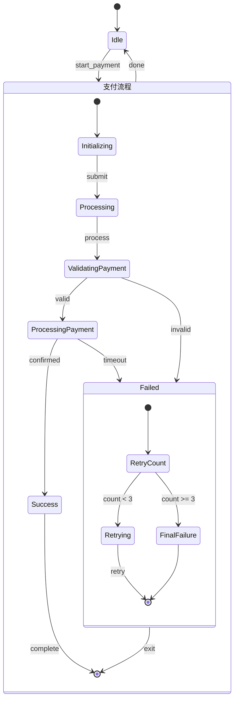
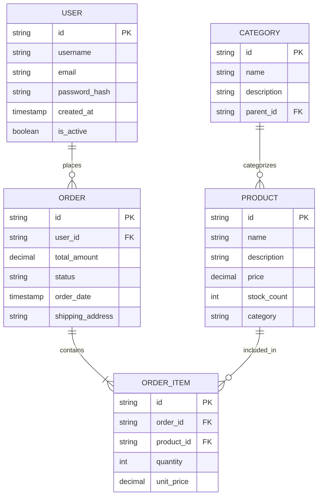
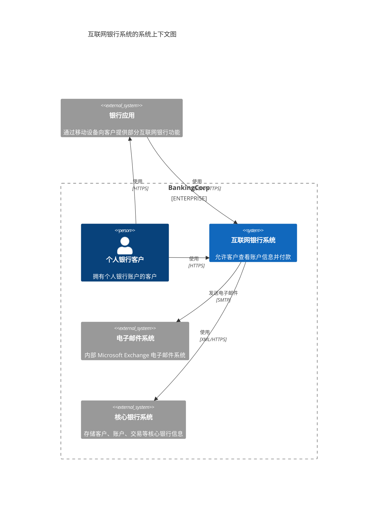

# 高级 Mermaid 示例

本页展示更大、更接近真实场景的 Mermaid 图表。对于宽图表，全屏、重置和下载控件尤其有用。

## 带子图的高级流程图

```mermaid
flowchart TB
    subgraph Backend["后端服务"]
        direction TB
        API[API 网关] --> Auth[身份验证]
        API --> Cache[Redis 缓存]
        API --> DB[(数据库)]
        Cache --> DB
    end

    subgraph Frontend["前端应用"]
        direction TB
        UI[用户界面] --> State[状态管理]
        State --> APIClient[API 客户端]
        APIClient --> Retry[重试逻辑]
    end

    Frontend ---> Backend

    style Frontend fill:#f9f,stroke:#333,stroke-width:2px
    style Backend fill:#bbf,stroke:#333,stroke-width:2px
```

## 带激活和注释的高级时序图

```mermaid
sequenceDiagram
    participant User as 用户
    participant Client as 客户端
    participant LoadBalancer as 负载均衡器
    participant ServiceA as 服务A
    participant ServiceB as 服务B
    participant Database as 数据库

    rect rgb(200, 220, 255)
    note right of User: 身份验证流程
    User->>+Client: 登录请求
    Client->>+LoadBalancer: POST /auth
    LoadBalancer->>+ServiceA: 路由请求
    ServiceA->>+Database: 验证凭据
    Database-->>-ServiceA: 找到用户
    ServiceA-->>-LoadBalancer: JWT Token
    LoadBalancer-->>-Client: 成功响应
    Client-->>-User: 登录成功
    end

    rect rgb(255, 220, 220)
    note right of User: 数据请求流程
    User->>+Client: 获取数据
    Client->>+LoadBalancer: GET /data
    LoadBalancer->>+ServiceB: 路由请求
    ServiceB->>+Database: 查询数据
    Database-->>-ServiceB: 返回结果
    ServiceB-->>-LoadBalancer: 格式化响应
    LoadBalancer-->>-Client: 发送数据
    Client-->>-User: 展示数据
    end
```

## 高级 Git 图

```mermaid
gitGraph
    commit id: "init"
    branch develop
    commit id: "feature-1-start"
    branch feature/user-auth
    commit id: "auth-basic"
    commit id: "auth-social"
    checkout develop
    merge feature/user-auth
    branch feature/api
    commit id: "api-setup"
    commit id: "endpoints"
    checkout develop
    merge feature/api
    branch hotfix/security
    commit id: "fix-vulnerability"
    checkout main
    merge hotfix/security
    checkout develop
    merge main
    branch release/stable
    commit id: "version-bump"
    checkout main
    merge release/stable tag: "stable-release"
```

## 高级状态机

```mermaid
stateDiagram-v2
    [*] --> Idle
    state "支付流程" as Payment {
        [*] --> Initializing
        Initializing --> Processing: submit
        Processing --> ValidatingPayment: process
        ValidatingPayment --> ProcessingPayment: valid
        ValidatingPayment --> Failed: invalid
        ProcessingPayment --> Success: confirmed
        ProcessingPayment --> Failed: timeout
        Failed --> [*]: exit
        Success --> [*]: complete
    }

    Idle --> Payment: start_payment
    Payment --> Idle: done

    state Failed {
        [*] --> RetryCount
        RetryCount --> Retrying: count < 3
        RetryCount --> FinalFailure: count >= 3
        Retrying --> [*]: retry
        FinalFailure --> [*]
    }
```

## 高级 ER 图

```mermaid
erDiagram
    USER ||--o{ ORDER : places
    USER {
        string id PK
        string username
        string email
        string password_hash
        timestamp created_at
        boolean is_active
    }
    ORDER ||--|{ ORDER_ITEM : contains
    ORDER {
        string id PK
        string user_id FK
        decimal total_amount
        string status
        timestamp order_date
        string shipping_address
    }
    PRODUCT ||--o{ ORDER_ITEM : included_in
    PRODUCT {
        string id PK
        string name
        string description
        decimal price
        int stock_count
        string category
    }
    ORDER_ITEM {
        string id PK
        string order_id FK
        string product_id FK
        int quantity
        decimal unit_price
    }
    CATEGORY ||--o{ PRODUCT : categorizes
    CATEGORY {
        string id PK
        string name
        string description
        string parent_id FK
    }
```

## C4 图

```mermaid
C4Context
    title 互联网银行系统的系统上下文图
    Enterprise_Boundary(b0, "BankingCorp") {
        Person(customer, "个人银行客户", "拥有个人银行账户的客户")
        System(banking_system, "互联网银行系统", "允许客户查看账户信息并付款")

        System_Ext(mail_system, "电子邮件系统", "内部 Microsoft Exchange 电子邮件系统")
        System_Ext(mainframe, "核心银行系统", "存储客户、账户、交易等核心银行信息")
    }

    System_Ext(banking_app, "银行应用", "通过移动设备向客户提供部分互联网银行功能")

    Rel(customer, banking_system, "使用", "HTTPS")
    Rel(customer, banking_app, "使用", "HTTPS")
    Rel(banking_system, mail_system, "发送电子邮件", "SMTP")
    Rel(banking_system, mainframe, "使用", "XML/HTTPS")
    Rel(banking_app, banking_system, "使用", "JSON/HTTPS")

    UpdateLayoutConfig($c4ShapeInRow="3", $c4BoundaryInRow="1")
```
