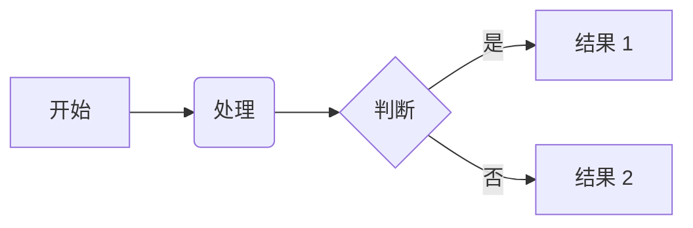
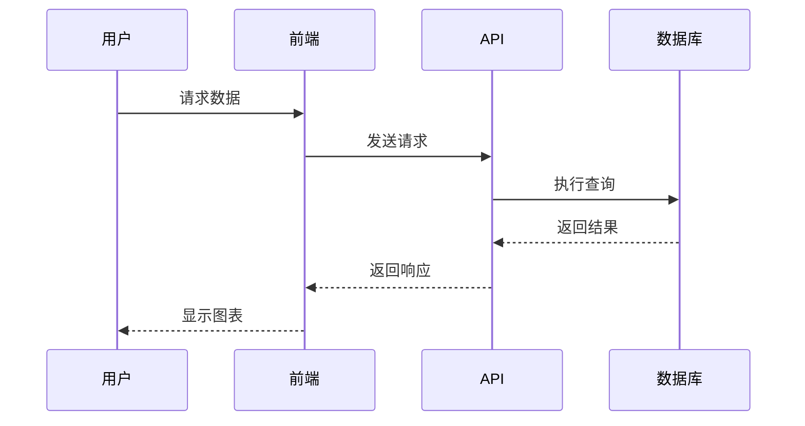
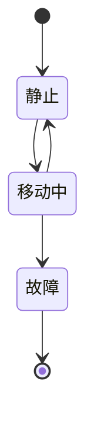
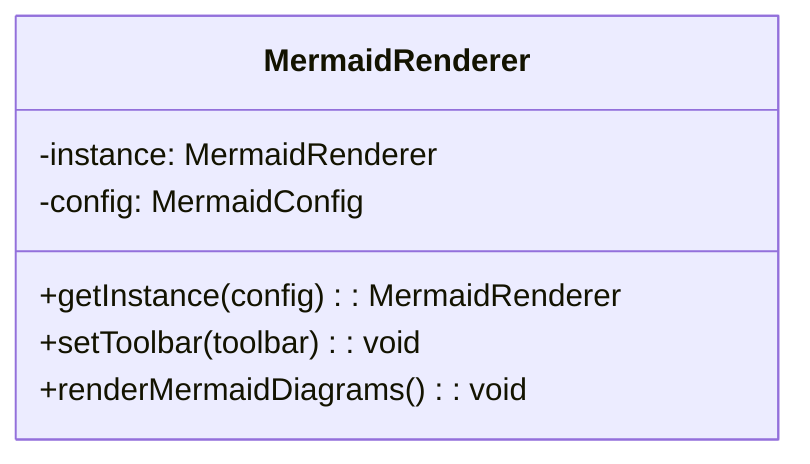
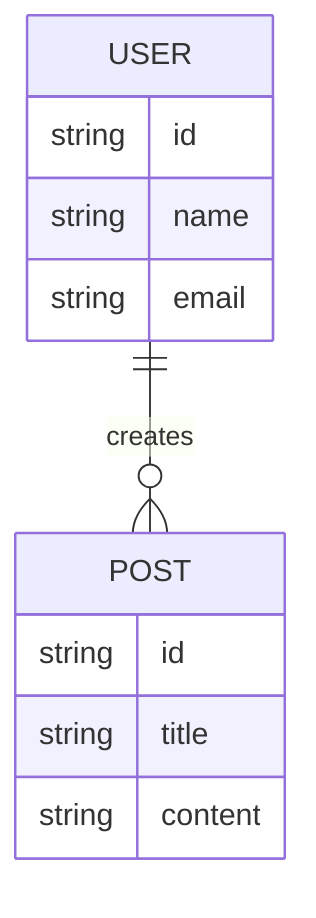
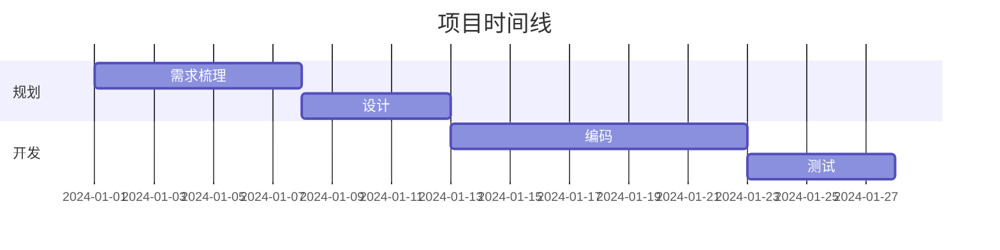
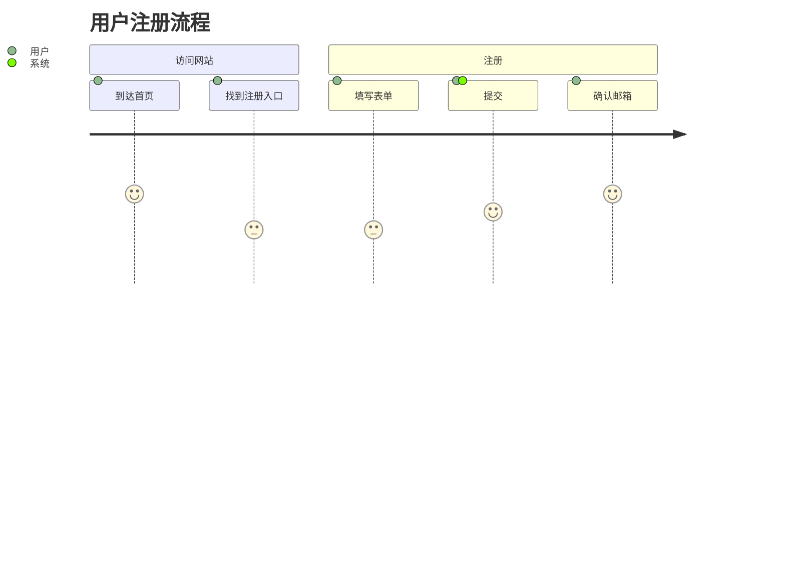

# 基础示例

本页展示多种 Mermaid 图表类型在中文文档中如何使用交互式控件渲染。每个图表都可以缩放、拖拽、重置、全屏查看、下载，并复制源代码。

## 流程图

```mermaid
flowchart LR
    A[开始] --> B(处理)
    B --> C{判断}
    C -->|是| D[结果 1]
    C -->|否| E[结果 2]
```

## 时序图

```mermaid
sequenceDiagram
    participant User as 用户
    participant Frontend as 前端
    participant API
    participant Database as 数据库
    User->>Frontend: 请求数据
    Frontend->>API: 发送请求
    API->>Database: 执行查询
    Database-->>API: 返回结果
    API-->>Frontend: 返回响应
    Frontend-->>User: 显示图表
```

## 状态图

```mermaid
stateDiagram-v2
    [*] --> 静止
    静止 --> 移动中
    移动中 --> 静止
    移动中 --> 故障
    故障 --> [*]
```

## 类图

```mermaid
classDiagram
    class MermaidRenderer {
        -instance: MermaidRenderer
        -config: MermaidConfig
        +getInstance(config): MermaidRenderer
        +setToolbar(toolbar): void
        +renderMermaidDiagrams(): void
    }
```

## 实体关系图

```mermaid
erDiagram
    USER ||--o{ POST : creates
    USER {
        string id
        string name
        string email
    }
    POST {
        string id
        string title
        string content
    }
```

## Gantt 图

```mermaid
gantt
    title 项目时间线
    dateFormat  YYYY-MM-DD
    section 规划
    需求梳理 :a1, 2024-01-01, 7d
    设计     :a2, after a1, 5d
    section 开发
    编码     :a3, after a2, 10d
    测试     :a4, after a3, 5d
```

## 用户旅程图

```mermaid
journey
    title 用户注册流程
    section 访问网站
        到达首页: 5: 用户
        找到注册入口: 3: 用户
    section 注册
        填写表单: 3: 用户
        提交: 4: 用户, 系统
        确认邮箱: 5: 用户
```
