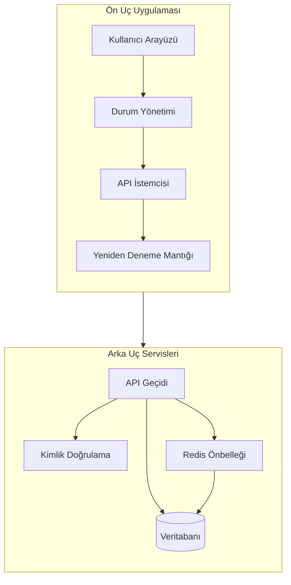
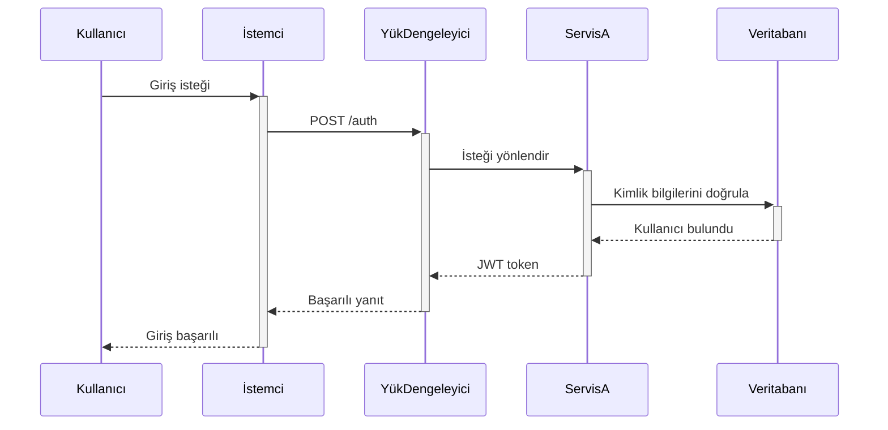
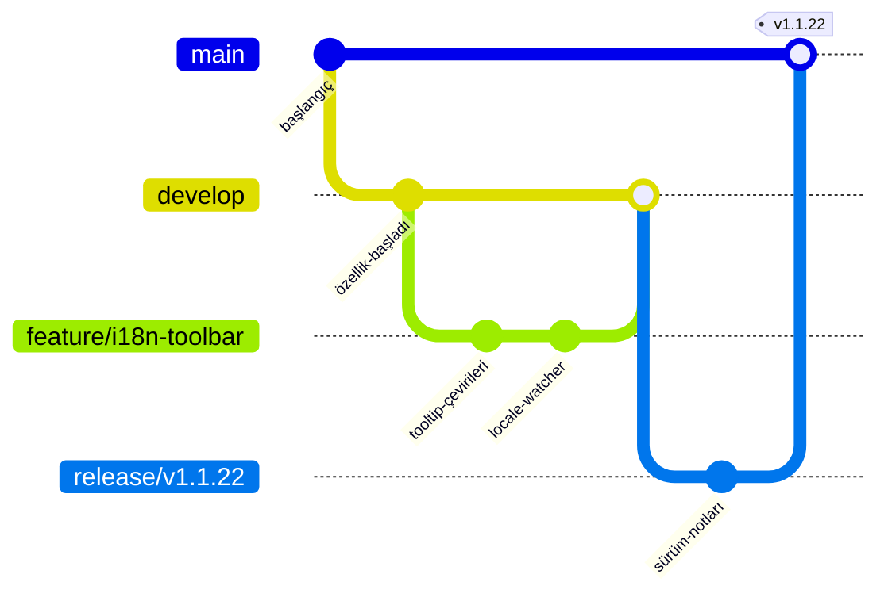

# Gelişmiş Mermaid Örnekleri

Bu sayfa, daha büyük ve gerçek dünyaya yakın Mermaid diyagramları üzerinde toolbar davranışını gözlemlemek için hazırlanmıştır.

## Alt Grafikler İçeren Gelişmiş Akış Diyagramı

## Notlar ve Aktivasyonlarla Sıralama Diyagramı

## Git Akışı

