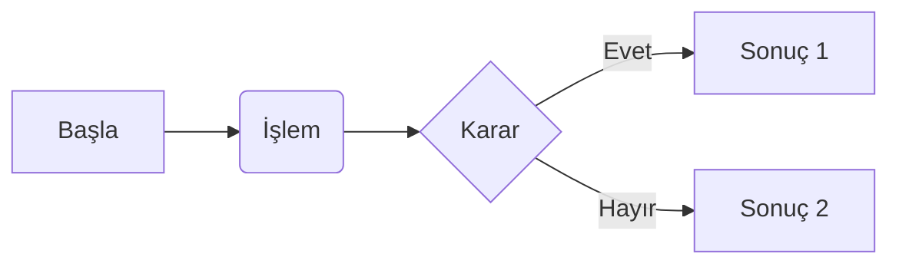
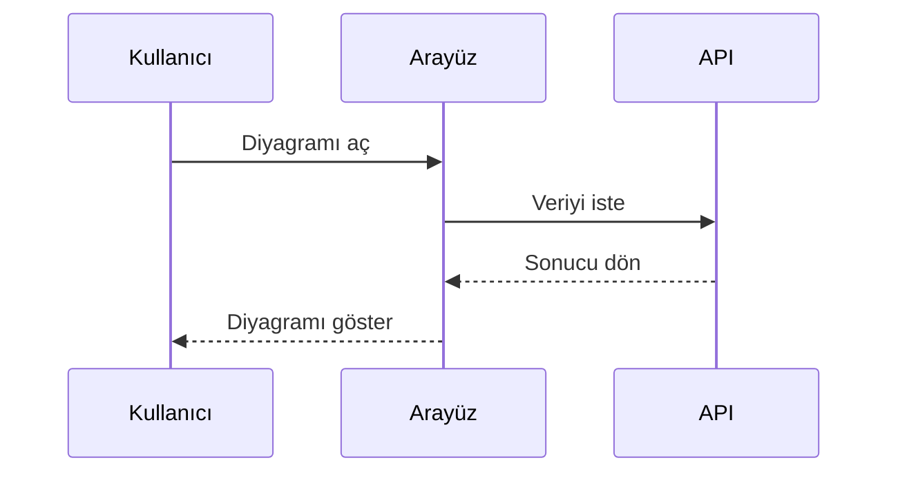

# Temel Örnekler

Bu sayfa, Türkçe locale altında Mermaid araç çubuğunun ve temel diyagram etkileşimlerinin beklendiği gibi çalıştığını doğrulamak için hazırlanmıştır.

- Yakınlaştırma, sıfırlama, kopyalama ve indirme düğmeleri Türkçe başlıklarla görünmelidir.
- Tema veya locale değiştiğinde araç çubuğu yeniden mount edilmeden güncellenmelidir.

## Akış Diyagramı

## Sıralama Diyagramı

