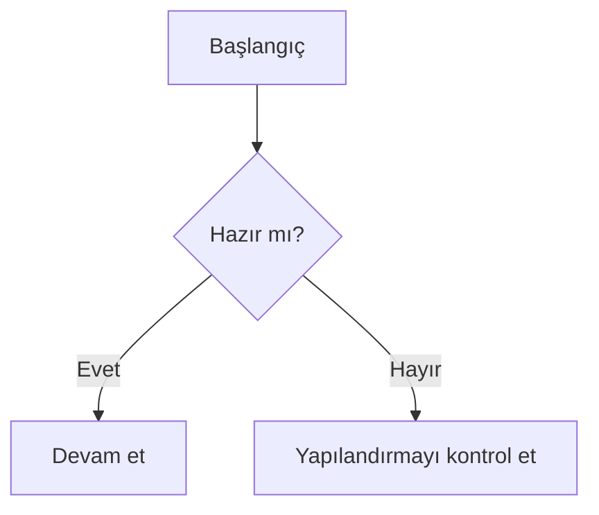

# Hızlı Başlangıç

## Kurulum

Paketi tercih ettiğiniz paket yöneticisiyle kurun:

::: code-group

```bash [npm]
npm install vitepress-mermaid-renderer
```

```bash [yarn]
yarn add vitepress-mermaid-renderer
```

```bash [pnpm]
pnpm add vitepress-mermaid-renderer
```

```bash [bun]
bun add vitepress-mermaid-renderer
```

:::

## Kurulum Sonrası Yapılandırma

`.vitepress/theme/index.ts` içinde renderer'ı başlatıp Mermaid diyagramlarını sayfa yaşam döngüsüne bağlayın:

```typescript
import { h, nextTick, watch } from "vue";
import type { Theme } from "vitepress";
import DefaultTheme from "vitepress/theme";
import { useData } from "vitepress";
import { createMermaidRenderer } from "vitepress-mermaid-renderer";

export default {
  extends: DefaultTheme,
  Layout: () => {
    const { isDark, localeIndex } = useData();

    const initMermaid = () => {
      const mermaidRenderer = createMermaidRenderer({
        theme: isDark.value ? "dark" : "forest",
      });

      mermaidRenderer.setToolbar({
        i18n: {
          localeIndex: localeIndex.value,
          locales: {
            tr: {
              tooltips: {
                zoomIn: "Yakınlaştır",
                zoomOut: "Uzaklaştır",
                resetView: "Görünümü sıfırla",
                copyCode: "Kodu kopyala",
                download: "Diyagramı indir",
                toggleFullscreen: "Tam ekranı aç/kapa",
              },
            },
          },
        },
      });
    };

    nextTick(() => initMermaid());
    watch(() => [isDark.value, localeIndex.value], initMermaid);

    return h(DefaultTheme.Layout);
  },
} satisfies Theme;
```

## Temel Kullanım

Markdown içinde `mermaid` dil etiketiyle bir kod bloğu oluşturun:



Bu blok etkileşimli bir Mermaid diyagramı olarak render edilir.

## i18n için Neden Faydalı?

Bu test projesi şunları hızlıca doğrulamanızı sağlar:

- Locale değiştiğinde toolbar tooltip metinlerinin güncellenmesi
- Aynı bileşen ağacında İngilizce ve Türkçe sayfaların çalışması
- Tema değişimlerinin Mermaid görünümüne yansıması
